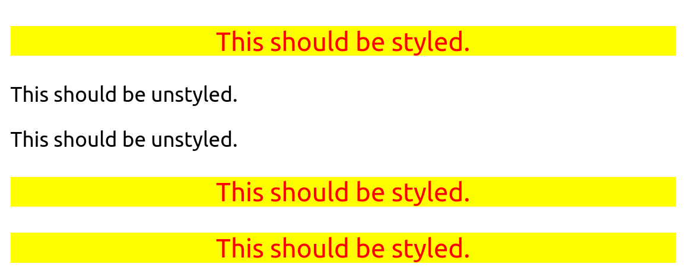

# Descendant Combinator
Understanding how combinators work can become a lot easier when you start playing around with them and see what exactly is affected by them versus what isn't.

The goal of this exercise is to apply styles to elements that are descendants of another element, while leaving elements that *aren't* descendants of that element unstyled.

You can use either type or class selectors for this exercise; use whichever you may feel you want to practice with more. The HTML file is set up (so no need to edit anything in it) such that any combination of selectors will work, so if you're feeling adventurous you can even try combining a type *and* class selector for the descendant combinator.

The properties you need to add are:

* Only the `p` elements that are descendants of the `div` element should have a yellow background, red text, a font size of 20px, and center aligned.

## Desired Outcome



### Self Check
- Do the elements that contain the text "This should be styled" have the correct styles applied?
- Do the elements that contain the text "This should be unstyled" have no styles applied?


## Descendant Combinator

Combinators allow us to combine multiple selectors differently than either grouping or chaining them, as they show a relationship between the selectors. There are four types of combinators in total, but for right now we’re going to only show you the descendant combinator, which is represented in CSS by a single space between selectors. A descendant combinator will only cause elements that match the last selector to be selected if they also have an ancestor (parent, grandparent, etc) that matches the previous selector.

So something like .ancestor .child would select an element with the class child if it has an ancestor with the class ancestor. Another way to think of it is child will only be selected if it is nested inside of ancestor, no matter how deep. Take a quick look at the example below and see if you can tell which elements would be selected based on the CSS rule provided:
```
<!-- index.html -->

<div class="ancestor"> <!-- A -->
  <div class="contents"> <!-- B -->
    <div class="contents"> <!-- C -->
    </div>
  </div>
</div>

<div class="contents"></div> <!-- D -->
```
```
/* styles.css */

.ancestor .contents {
  /* some declarations */
}
```
In the above example, the first two elements with the contents class (B and C) would be selected, but that last element (D) won’t be. Was your guess correct?

There’s really no limit to how many combinators you can add to a rule, so .one .two .three .four would be totally valid. This would just select an element that has a class of four if it has an ancestor with a class of three, and if that ancestor has its own ancestor with a class of two, and so on. You generally want to avoid trying to select elements that need this level of nesting, though, as it can get pretty confusing and long, and it can cause issues when it comes to specificity.